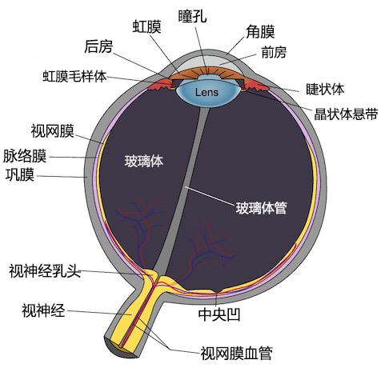
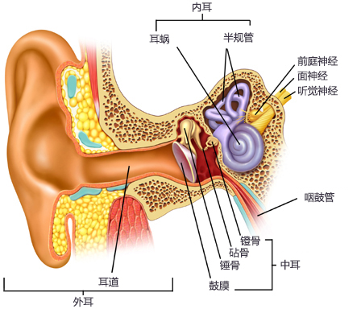
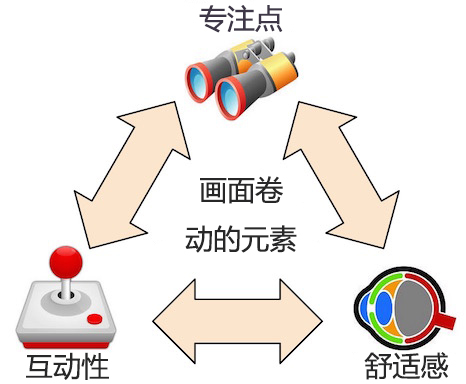
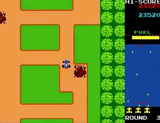
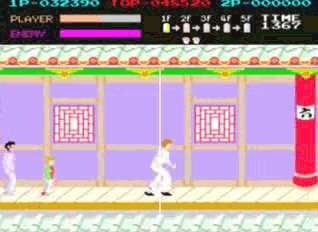
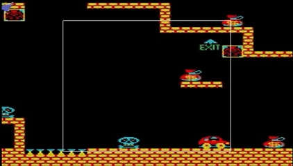
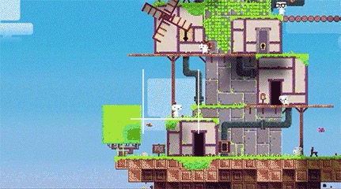

# 2D 横版游戏摄像机原理与实践

关键词

- 动态形变
- 顶点动画
- 摄像机运镜

## 卷轴

卷轴，或者说运镜技术，想要解决的问题是，如何才能更好地呈现一个单屏无法完全显示的大场景。画面卷动技术有许多潜在的细节需要仔细考虑：譬如说抉择玩家能看到的画面，从设计者的角度考虑，来凸显我们玩家予以关注的内容。并以一种流畅自如的方式将它们呈现给玩家。

## 背景知识：视觉神经

在我们检索这些游戏前，先来初步了解一下和卷轴有关的视觉神经知识，以便加深我们对视觉和感知的理解。这样我们就能明白有些卷轴的画面卷动方式为什么可能造成问题。

眼球内的接收带“黄斑中心凹”（fovea-centralis）负责处理锐利与精细的中央视觉，而第二、第三接收带“副中央凹”（parafovea）与“中心凹周围区”（perifovea），则专门将影像与运动压缩为能够被快速识别的模式，其中包含辨识那些我们熟知且警觉的图形，以及它们在速度方向上的动态变化。

这些视觉讯号拥有直达大脑杏仁核的快速通道，这样即使视觉中枢正在处理输入，也能保有警觉和应变反应。随着时间推移，对大脑进行的专门训练，尤其是配合控制来尝试改变周边视野的专门训练，已经被证明卓有成效。

前庭系统位于内耳，是掌管平衡及提供空间方向感的器官。它所发送的讯号能够使得人体在聚焦特定视觉细节时仍能掌控自身的平衡。

有些人，比如说我吧，如果在车内看书，由于缺乏周遭的视觉反馈，加之速度上的改变，可能就会产生晕眩，恶心的感觉。

相反的状况亦然:如果“中心凹周围区”（perifovea）感知到背景的快速变化，大脑也会期待前庭系统给出相应的反馈。如果这个讯号并不存在（比方说你其实一动不动地窝在电脑面前），也会产生类似的晕眩反应。

因此，造成视觉与前庭系统间冲突的讯号都可能会导致恶心与不适，尽管这个问题主要发生在 3D 游戏（尤其是 VR 游戏）中，但对 2D 游戏的设计也会产生非常显著的影响。

## 专注点、互动性、舒适感

为进一步加深对画面卷动问题的理解，我将需要克服的挑战划分为三类:

- 专注点:使摄像机提供充分的游戏信息与反馈（玩家需要看到的内容）

- 互动性:为玩家提供对显示内容清楚明了的控制，使得背景的变化可以预测并与控制紧密相连（玩家想要看到的内容）

- 舒适感:弱化背景的切换，使其连贯舒缓（如何平滑舒缓地达成前述的需求）

## 跟随操作

**对你所操作的对象保持关注**

我们先从基础开始。一般而言，玩家拥有主角的控制权。这意味着摄像机应当紧紧跟随主角，使注意力主要集中在主角身上。

### 迷魂车(Rally-x)

固定位置机制。

固定位置（position-locking）

- 摄像机锁定在玩家角色所在位置

### 成龙踢馆

边缘捕捉（edge-snapping）机制，在这种机制下，当角色到达关卡尽头时，摄像机会尽量与场景边缘贴齐，使得玩家能够离开原本所在的锚点。

## 抑止摄像机运动

**避免难以预料的无谓画面颤抖**

我们应当如何避免完全无必要的摄像机运动呢？三十年前，画面卷动技术曾造成过一系列问题:它非常吃 CPU 的性能，而且需要不停地重绘屏幕上的大部分内容。即便克服了这些困难，在那个时候，大块的像素也会让画面卷动的效果显得支离破碎，飘忽不定。最佳方案是，只保留最小需求的屏幕变动。有一种解决办法是，允许角色在一个特定的窗格内移动，只有当角色到达窗格边缘时，摄像机才会开始运动。

### 跳跳车

《跳跳车》（Jump Bug）是许多人心目中的第一款平台跳跃游戏。尽管从技术上讲，角色只不过在重复地向上跳跃，玩家所能做出的控制受限于跳跃高度和左右方向。这款游戏的多数时间里，使用的都是强制位移的摄像机，迫使玩家在躲避障碍的同时持续向上，这也是当时多数其他游戏所采用的方式。

摄像机窗格（camera-window）

- 当玩家接触窗格边缘时推动摄像机位置

### 菲斯

在近期的游戏中我们也还能看到摄像机窗格（camera-window）技术的运用。来看看《菲斯》（Fez）是如何做的:当玩家旋转场景时，水平的摄像机窗格（camera-window）位置会保持不变，而精心挑选的转轴能让角色仍然位于窗格内部。《菲斯》所选用的摄像机窗格（camera-window）运用方式非常特别，因为它需要配合如此独特的游戏机制来提供理想的摄像机方案，这些内容我们后文还会提到。在垂直的方向上，它使用的摄像机方案混合了基本的固定位置（postion-locking）机制，同时运用平滑插值（lerp-smoothing）技术来柔化动态，这部分内容我们后文也会再行描述。

摄像机窗格-水平方向（camera-window horiz.）

- 在场景立体旋转时摄像机窗格也依然保持不变

固定位置-垂直方向（position-locking vert.）

平滑插值（lerp-smoothing）

基于区域的锚点（region-based-anchors）

手动控制（manual-control \*）

- 通过右摇杆能控制额外的摄像机运镜

注意:灰色显示的词条表示这些是我们后文才会陆续描述的摄像机控制技巧。

## 捕捉
